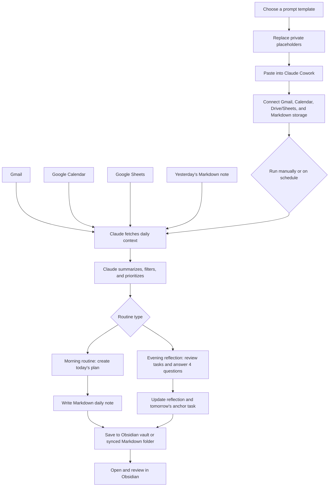

# mindstack-ai: Build Your First Personal AI Agent With an Easy Tech Stack

🌐 [English](Projects/mindstack-ai/README.md) | [Tiếng Việt](README.vi.md)

> mindstack-ai is a no-code and low-code starter kit for building a personal AI agent using simple, accessible tools: Claude Cowork, Google connectors, OpenCode, MCP, Composio, and Obsidian.

  

## What Is This?

mindstack-ai helps you build a daily personal AI agent that reads your Gmail, Google Calendar, Google Sheets, and Markdown daily notes that Obsidian can open, then turns them into a morning plan and evening reflection. You can start with the no-code Claude Cowork setup, then add OpenCode for local file control and MCP/Composio when you need external app automation.

You do not need to be a developer. Start by copying one prompt, replacing the placeholders, and running it in Claude Cowork.

## Table Of Contents

- [Quick Start](#quick-start)
- [End-to-End Workflow](#end-to-end-workflow)
- [What You Will Build](#what-you-will-build)
- [Repo Structure](#repo-structure)
- [Prompts](#prompts)
- [Full Setup Guide](#full-setup-guide)
- [Personalization Checklist](#personalization-checklist)
- [Google Sheets Links](#google-sheets-links)
- [Requirements](#requirements)
- [Contributing](#contributing)
- [License](#license)

## Quick Start

1. Open [`prompts/morning-routine.md`](morning-routine.md).
2. Replace the user-input placeholders with your own name, timezone, Obsidian or Markdown folder path, and Google Sheet links.
3. Paste the prompt into Claude Cowork.
4. Connect Gmail, Calendar, Drive/Sheets, and a Markdown storage destination that Obsidian can open.
5. Run the prompt once manually before scheduling it.

The evening workflow is in [`prompts/evening-reflection.md`](evening-reflection.md).

## End-to-End Workflow



## What You Will Build

- Morning routine: reads yesterday's note, Gmail, Calendar, and school/work sheets, then creates today's Markdown daily note for Obsidian.
- Evening reflection: reviews open tasks, asks four reflection questions one at a time, writes a summary, and saves tomorrow's anchor task.
- Optional low-code layer: uses OpenCode for local Markdown and repo edits, then MCP/Composio only when you need external app connectors.

## Repo Structure

```text
mindstack-ai/
├── README.md
├── README.vi.md
├── CONTRIBUTING.md
├── CODE_OF_CONDUCT.md
├── LICENSE
├── docs/
├── prompts/
├── examples/
└── .github/ISSUE_TEMPLATE/
```

## Prompts

- [`prompts/morning-routine.md`](morning-routine.md) - public template adapted from a real Claude Cowork morning workflow.
- [`prompts/evening-reflection.md`](evening-reflection.md) - public template for guided end-of-day review.
- [`prompts/one-prompt-installer.md`](one-prompt-installer.md) - optional setup prompt for generating Claude Cowork prompts or OpenCode file setup from one place.
- [`prompts/personalization-checklist.md`](personalization-checklist.md) - every private user-input field you must replace before using or sharing.

## Full Setup Guide

Start here: [`docs/README.md`](Projects/mindstack-ai/docs/README.md)

Recommended no-code path:

1. [`docs/00-why-obsidian.md`](00-why-obsidian.md)
2. [`docs/01-getting-started.md`](01-getting-started.md)
3. [`docs/02-claude-cowork-setup.md`](02-claude-cowork-setup.md)
4. [`docs/04-google-sheets-links.md`](04-google-sheets-links.md)
5. [`docs/05-morning-routine.md`](05-morning-routine.md)
6. [`docs/06-evening-reflection.md`](06-evening-reflection.md)
7. [`docs/07-faq.md`](07-faq.md)
8. [`docs/08-troubleshooting.md`](08-troubleshooting.md)

Optional low-code path after the no-code workflow works:

1. [`docs/03-opencode-mcp-composio-setup.md`](03-opencode-mcp-composio-setup.md)

## Personalization Checklist

Before you run the prompts, replace these private values:

- `{{USER_NAME}}` - your name or nickname.
- `{{TIMEZONE}}` - for example, `GMT+7, ICT`.
- `{{OBSIDIAN_VAULT_PATH}}` - your local Obsidian vault path or synced Markdown folder path.
- `{{DAILY_NOTE_FOLDER}}` - for example, `Daily/`.
- `{{DATE_FORMAT}}` - daily note filename format, for example `DD-MM-YYYY`.
- `{{EMAIL_LOOKBACK_HOURS}}` - how far back Gmail should be searched.
- `{{CALENDAR_LOOKAHEAD_DAYS}}` - how many future calendar days to list.
- `{{GOOGLE_DRIVE_READ_TOOL}}` - the connector/tool name your environment exposes.
- `{{ASSIGNEE_NAMES}}` - names the AI should match in shared task sheets.
- `{{SHEET_NAME_1}}`, `{{SPREADSHEET_ID_OR_URL_1}}` - your own Google Sheet names and file IDs or URLs.
- `{{TASK_COLUMN}}`, `{{DESCRIPTION_COLUMN}}`, `{{DEADLINE_COLUMN}}`, `{{ASSIGNEE_COLUMN}}`, `{{STATUS_COLUMN}}` - the exact column names in your sheets.

Leave assistant-generated placeholders such as `{{TODAY_ISO_DATE}}`, `{{TODAY_DISPLAY_DATE}}`, and `{{DAY_1}}` inside the output template. The assistant fills those at runtime.

Do not publish your real Google Sheet IDs, local paths, API keys, or private email addresses in a public repo.

## Google Sheets Links

Most Google Sheets URLs look like this:

```text
https://docs.google.com/spreadsheets/d/SPREADSHEET_ID/edit#gid=0
```

Copy the value between `/d/` and `/edit`. That is your spreadsheet ID.

Example:

```text
URL: https://docs.google.com/spreadsheets/d/1abcDEF_fake_id_123/edit#gid=0
ID:  1abcDEF_fake_id_123
```

Put either the full link or the ID into the prompt, depending on what your Claude connector or MCP tool supports. See [`docs/04-google-sheets-links.md`](04-google-sheets-links.md) for the full guide.

## Requirements

No-code path:

- Claude Cowork or a Claude workflow that supports scheduled tasks.
- Gmail, Google Calendar, Google Drive, and Google Sheets access.
- Obsidian or another Markdown note app.

Low-code path:

- OpenCode.
- Node.js if your OpenCode/MCP setup requires it.
- MCP servers or Composio connectors for Google Workspace and other external apps.
- API keys for the providers you choose.

## Contributing

Non-developers are welcome. You can contribute by fixing wording, translating docs, sharing your adapted prompt, reporting confusing steps, or suggesting new workflows.

Read [`CONTRIBUTING.md`](CONTRIBUTING.md) to get started.

## License

This project is dual-licensed:

- Source code, docs, and config are licensed under the MIT License.
- Prompt templates are dedicated to the public domain under CC0 1.0 Universal.

See [`LICENSE`](LICENSE.md) and [`prompts/LICENSE.md`](LICENSE.md) for details.
