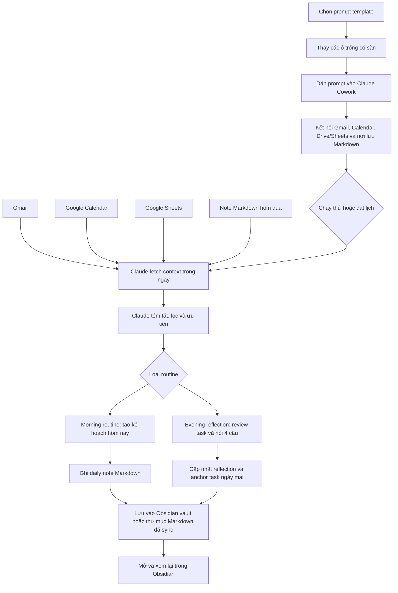

# mindstack-ai: Tạo AI Agent Cá Nhân Với Tech Stack Dễ Bắt Đầu

🌐 [English](Projects/mindstack-ai/README.md) | [Tiếng Việt](README.vi.md)

> mindstack-ai là bộ hướng dẫn no-code và low-code để tự tạo AI agent cá nhân bằng các công cụ dễ tiếp cận: Claude Cowork, Google connectors, OpenCode, MCP, Composio và Obsidian.

  

## Repo Này Là Gì?

mindstack-ai giúp bạn dựng một AI agent cá nhân hằng ngày: đọc Gmail, Google Calendar, Google Sheets và ghi chú Markdown mà Obsidian có thể mở, sau đó tạo kế hoạch buổi sáng và phần reflection buổi tối. Bạn có thể bắt đầu bằng Claude Cowork theo hướng no-code, rồi thêm OpenCode để thao tác file local và MCP/Composio khi cần kết nối app bên ngoài.

Bạn không cần biết lập trình. Cách nhanh nhất là copy prompt, thay các phần `{{PLACEHOLDER}}`, rồi chạy thử trong Claude Cowork.

## Bắt Đầu Nhanh

1. Mở [`prompts/morning-routine.md`](morning-routine.md).
2. Thay các placeholder người dùng cần điền bằng tên, múi giờ, đường dẫn Obsidian hoặc thư mục Markdown và link Google Sheets của bạn.
3. Dán prompt vào Claude Cowork.
4. Kết nối Gmail, Calendar, Drive/Sheets và nơi lưu Markdown mà Obsidian có thể mở.
5. Chạy thử một lần trước khi đặt lịch tự động.

Prompt buổi tối nằm ở [`prompts/evening-reflection.md`](evening-reflection.md).

## Luồng Dữ Liệu End-to-End

Mỗi routine đều đi theo cùng một con đường từ đầu đến cuối:



| Giai đoạn | Việc xảy ra | Ở đâu |
|---|---|---|
| Fetch | Claude đọc Gmail, Google Calendar và Google Sheets qua connector | Cloud connector |
| Xử lý | Claude tóm tắt, lọc và cấu trúc dữ liệu thành daily note | Claude Cowork |
| Ghi | Claude lưu file Markdown đã hoàn thiện vào Obsidian vault hoặc thư mục đồng bộ | Obsidian / thư mục Markdown đồng bộ |

Nếu môi trường không thể tự ghi file, Claude sẽ xuất toàn bộ Markdown và nêu rõ đường dẫn cần lưu.

## Bạn Sẽ Tạo Được Gì?

- Morning routine: đọc note hôm qua, Gmail, Calendar và sheet học tập/công việc, rồi tạo daily note Markdown hôm nay và ghi vào Obsidian vault.
- Evening reflection: kiểm tra task còn mở, hỏi 4 câu reflection từng câu một, viết tóm tắt và cập nhật phần Evening Reflection trong daily note hôm nay.
- One-prompt installer: prompt tùy chọn để tạo setup Claude Cowork hoặc chuẩn bị file OpenCode từ một chỗ.
- Tầng low-code tùy chọn: dùng OpenCode để thao tác Markdown/repo local, rồi thêm MCP/Composio khi cần connector cho app bên ngoài.

## Tài Liệu Hướng Dẫn

Bắt đầu tại [`docs/README.md`](Projects/mindstack-ai/docs/README.md).

Thứ tự no-code khuyến nghị:

1. [`docs/00-why-obsidian.md`](00-why-obsidian.md)
2. [`docs/01-getting-started.md`](01-getting-started.md)
3. [`docs/02-claude-cowork-setup.md`](02-claude-cowork-setup.md)
4. [`docs/04-google-sheets-links.md`](04-google-sheets-links.md)
5. [`docs/05-morning-routine.md`](05-morning-routine.md)
6. [`docs/06-evening-reflection.md`](06-evening-reflection.md)
7. [`docs/07-faq.md`](07-faq.md)
8. [`docs/08-troubleshooting.md`](08-troubleshooting.md)

Sau khi no-code chạy ổn, xem thêm tầng low-code tùy chọn tại [`docs/03-opencode-mcp-composio-setup.md`](03-opencode-mcp-composio-setup.md).

## Những Phần Phải Thay Trước Khi Dùng

- `{{USER_NAME}}` - tên hoặc nickname của bạn.
- `{{TIMEZONE}}` - ví dụ `GMT+7, ICT`.
- `{{OBSIDIAN_VAULT_PATH}}` - đường dẫn vault Obsidian hoặc thư mục Markdown đã sync.
- `{{DAILY_NOTE_FOLDER}}` - ví dụ `Daily/`.
- `{{DATE_FORMAT}}` - định dạng tên file daily note, ví dụ `DD-MM-YYYY`.
- `{{EMAIL_LOOKBACK_HOURS}}` - số giờ Gmail cần đọc ngược lại.
- `{{CALENDAR_LOOKAHEAD_DAYS}}` - số ngày Calendar cần đọc trước.
- `{{GOOGLE_DRIVE_READ_TOOL}}` - tên connector/tool đọc Drive hoặc Sheets trong môi trường của bạn.
- `{{ASSIGNEE_NAMES}}` - các tên mà AI cần tìm trong sheet task.
- `{{SHEET_NAME_1}}`, `{{SPREADSHEET_ID_OR_URL_1}}` - tên sheet và ID/link Google Sheets của bạn.
- `{{TASK_COLUMN}}`, `{{DESCRIPTION_COLUMN}}`, `{{DEADLINE_COLUMN}}`, `{{ASSIGNEE_COLUMN}}`, `{{STATUS_COLUMN}}` - tên cột chính xác trong sheet.

Các placeholder do assistant tự điền như `{{TODAY_ISO_DATE}}`, `{{TODAY_DISPLAY_DATE}}` và `{{DAY_1}}` nên được giữ trong template.

Không public Google Sheet ID thật, đường dẫn máy cá nhân, API key hoặc email riêng trong repo công khai.

## Cách Lấy Link Google Sheets

Link Google Sheets thường có dạng:

```text
https://docs.google.com/spreadsheets/d/SPREADSHEET_ID/edit#gid=0
```

Phần nằm giữa `/d/` và `/edit` là spreadsheet ID.

Ví dụ:

```text
URL: https://docs.google.com/spreadsheets/d/1abcDEF_fake_id_123/edit#gid=0
ID:  1abcDEF_fake_id_123
```

Xem hướng dẫn chi tiết tại [`docs/04-google-sheets-links.md`](04-google-sheets-links.md).

## Đóng Góp

Bạn không cần biết code để đóng góp. Bạn có thể sửa lỗi diễn đạt, dịch tài liệu, chia sẻ prompt đã chỉnh theo workflow của bạn, báo chỗ khó hiểu hoặc đề xuất prompt mới.

Đọc [`CONTRIBUTING.md`](CONTRIBUTING.md) để bắt đầu.

## License

Project này dùng dual license:

- Source code, docs và config được cấp phép theo MIT License.
- Prompt templates được đưa vào public domain theo CC0 1.0 Universal.

Xem [`LICENSE`](LICENSE.md) và [`prompts/LICENSE.md`](LICENSE.md) để biết chi tiết.
